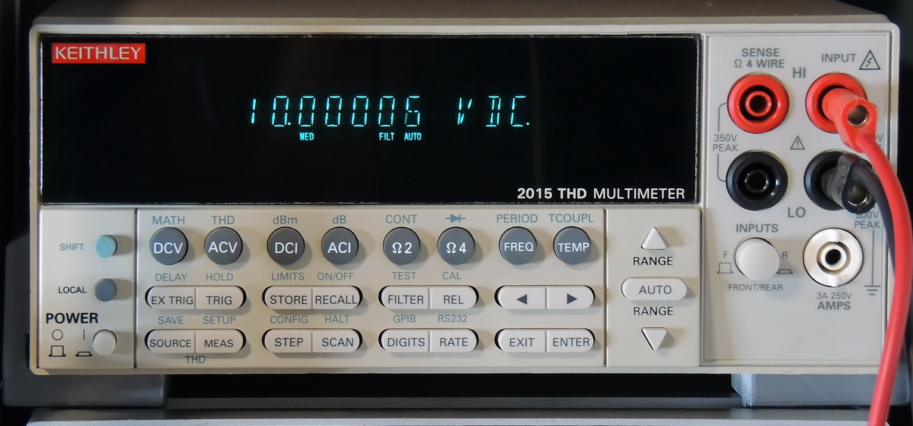

# free_keithley
Plotting / measurement software for Keithley 2015 THD multimeter



## Utilities
 - THD measurement: THD/THDN and distortion of each harmonic
 - THD vs Power
 - Vdc logger
 - THD vs Freq.
 - Freq. response plot

## Requirements
 - `python 3.10+`
 - `matplotlib`
 - `python-pyserial`
 - `tkinter (tk)`

## Usage
```python thd_vs_power.py```

or

```python thd.py```

or..

```python freq_resp.py```

```python logger.py```

```python thd_vs_freq.py```

```python fft.py```

## Screenshots


## Donations
Pleeease support the development of this app by making a DONATION with PayPal.
Every dollar helps a lot!

<a href="https://www.paypal.com/cgi-bin/webscr?cmd=_s-xclick&hosted_button_id=U537V8SNQQ45J" target="_blank">

</a>

If you wish to make a donation, please click the above button or just send money to scim.spreadsheet@gmail.com via PayPal, choosing "Goods and Services".
Paypal is preferred over Patreon.

Thank you!

## Keithley 2015 limitations
https://www.head-case.org/forums/topic/21432-the-keithley-2015-and-2016-audio-analysing-multi-meters-guide-to-behaviour-limitations-and-issues/
